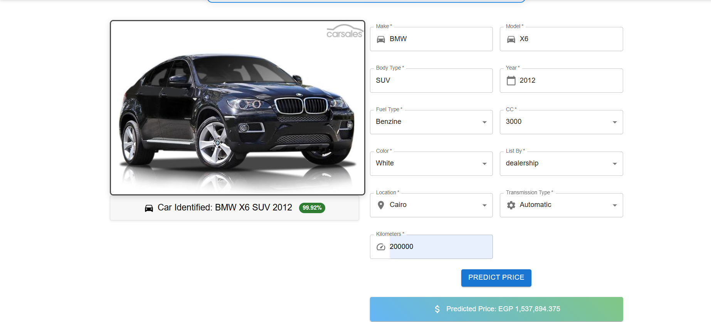
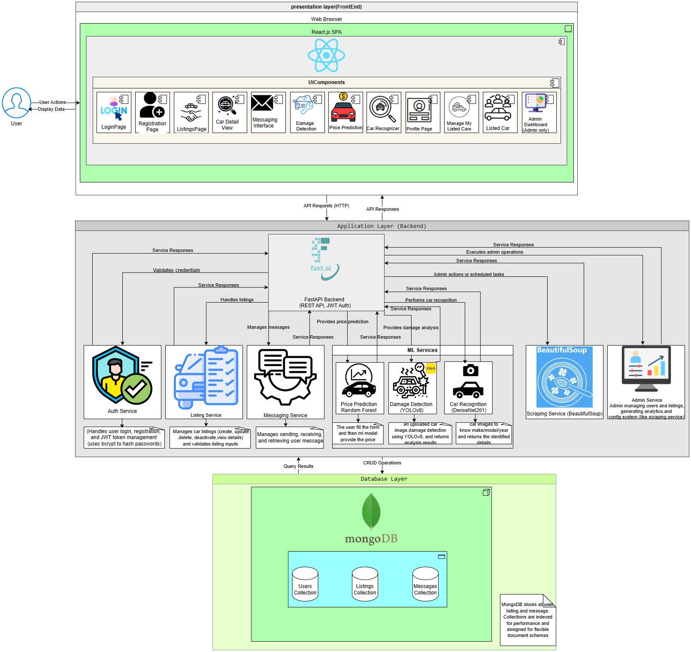
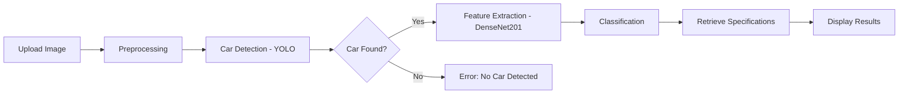
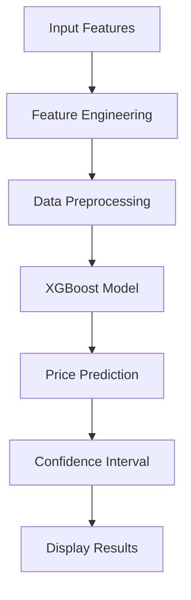
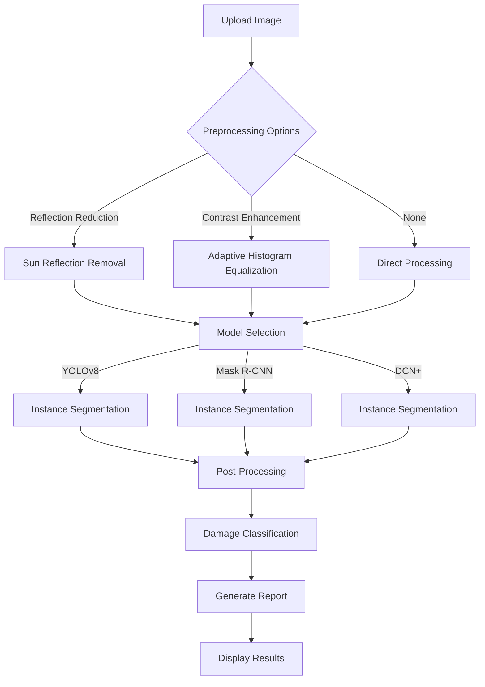

# 🚗 Vehicle Souq

<div align="center">
  
  
  ### AI-Powered Car Recognition, Price Prediction & Damage Detection System
  
  [](https://drive.google.com/file/d/17VFbIcNtBgj67R0oMhLIZJMNMDFrKmlF/view?usp=sharing)
  [](https://ieeexplore.ieee.org/document/11167441)
  [](thesis/)
  [](https://www.python.org/)
  [](https://reactjs.org/)
  [](LICENSE)

  <br/>

  <a href="https://drive.google.com/file/d/17VFbIcNtBgj67R0oMhLIZJMNMDFrKmlF/view?usp=sharing">
    
  </a>
  
  <p><i>Click the image above to watch our full demo video</i></p>
</div>

<br/>

---

## 📌 Overview

Vehicle Souq is a comprehensive AI-powered platform designed to revolutionize Egypt's used car market. The system addresses critical challenges including price inconsistencies, lack of transparency, and difficulty in assessing vehicle condition.

### Key Capabilities

| Feature | Description | Accuracy |
|---------|-------------|----------|
| 🔍 **Vehicle Recognition** | Identify make, model, year, and body type from a single image | 94.41% |
| 💰 **Price Prediction** | Fair market valuations based on 23,421+ real listings | 97% (R²=0.97) |
| 🔧 **Damage Detection** | AI-powered assessment using YOLOv8/Mask R-CNN | mAP@50: 0.87 |
| 📊 **Market Analytics** | Data-driven insights for buyers, sellers, and analysts | Real-time |

### The Challenge

Egypt's used car market faces unique challenges:
- **Price Volatility** - Inflation and market instability create unpredictable pricing
- **Information Asymmetry** - Buyers lack expertise to evaluate vehicles accurately  
- **Manual Valuation** - Traditional methods are time-consuming and inconsistent
- **Condition Assessment** - Difficulty in identifying and quantifying vehicle damage

### Our Solution

Vehicle Souq uniquely combines three AI systems:
1. **DenseNet201** for vehicle recognition (94.41% accuracy)
2. **XGBoost** for price prediction (97% accuracy, R² = 0.97)
3. **YOLOv8/Mask R-CNN** for damage detection and segmentation

<br/>

---

## 🎓 Research & Publication

<div align="center">

This project has been published and presented at the **2025 Intelligent Methods, Systems, and Applications (IMSA)** conference, held in Giza, Egypt.

**📄 [Used Car Price Prediction and Classification Using Machine Learning Approaches](https://ieeexplore.ieee.org/document/11167441)**

**Authors:** M. Hesham, H. Ahmed, M. L. Borham  
**Institution:** MSA University, Egypt  
**DOI:** 10.1109/IMSA65733.2025.11167441


<p><i>Certificate of Participation - IMSA 2025 Conference</i></p>

</div>

<details>
<summary><b>📋 Citation</b></summary>

```bibtex
@INPROCEEDINGS{11167441,
  author={Hesham, M. and Ahmed, H. and Borham, M. L.},
  booktitle={2025 Intelligent Methods, Systems, and Applications (IMSA)}, 
  title={Used Car Price Prediction and Classification Using Machine Learning Approaches}, 
  year={2025},
  pages={359-365},
  doi={10.1109/IMSA65733.2025.11167441}
}
```
</details>

<br/>

---

## 🚀 Key Features

### 1. 🎯 AI-Powered Vehicle Recognition

Instant car identification from a single image with 94.41% accuracy.

- ✅ Single image upload for instant identification
- ✅ Recognizes make, model, year, and body type
- ✅ Automatic population of detailed specifications
- ✅ No automotive expertise required

<div align="center">
  
  <p><i>Real-time vehicle recognition and price prediction in action</i></p>
</div>

### 2. 💰 Intelligent Price Prediction

Data-driven pricing based on 23,421 real market listings with 97% accuracy.

- ✅ XGBoost model with R² = 0.97
- ✅ Considers make, model, year, mileage, condition, and market trends
- ✅ Continuously updated with fresh market data
- ✅ Transparent pricing breakdown

### 3. 🔧 Advanced Damage Detection
Our multi-model damage detection system identifies six types of vehicle damage:

| Damage Type | Detection Method |
|------------|------------------|
| 🔴 Dent | Instance segmentation with confidence scoring |
| 🟢 Scratch | Edge detection and pattern recognition |
| 🔵 Crack | Structural damage analysis |
| 🟡 Glass Shatter | Transparency and fragmentation detection |
| 🟣 Lamp Broken | Component-specific damage identification |
| 🔵 Tire Flat | Shape and deflection analysis |

**Multiple Detection Models Available**:
- **YOLOv8 Segmentation**: Real-time detection with precise boundary delineation
- **Mask R-CNN**: Instance segmentation for detailed damage assessment
- **DCN+ (Optional)**: Enhanced feature extraction for complex damage patterns

**Key Capabilities**:
- ✅ Multi-damage detection in single image
- ✅ Confidence scoring for each detection
- ✅ Segmentation masks for precise damage boundaries
- ✅ Automated damage report generation
- ✅ Sun reflection reduction preprocessing
- ✅ Contrast enhancement for better visibility

### 4. 📊 Market Intelligence Dashboard

- ✅ Automated data collection from major platforms (Hatla2ee, Dubizzle)
- ✅ Interactive charts and trend analysis
- ✅ Market pricing patterns and anomalies
- ✅ Track demand and supply dynamics
- ✅ Location-based pricing variations

### 5. 🏪 Marketplace Features

<table>
<tr>
<td width="33%" valign="top">

**For Buyers**
- 🔍 Advanced search filters
- 📸 Image-based discovery
- 💡 Smart price recommendations
- 📋 Detailed specifications
- 🔔 Saved searches & alerts

</td>
<td width="33%" valign="top">

**For Sellers**
- 📝 Easy listing creation
- 💰 AI-suggested pricing
- 📊 Performance analytics
- 🖼️ Multi-image gallery
- 📱 Mobile-responsive

</td>
<td width="33%" valign="top">

**For Administrators**
- 🛠️ Data management tools
- 📈 System-wide analytics
- 👥 User management
- 🔄 Database maintenance
- 📊 Trend visualization

</td>
</tr>
</table>

<br/>

---

## 📊 Performance Metrics

### Price Prediction Models (Dubizzle Dataset - 23,421 Listings)

| Model | RMSE ↓ | R² ↑ | MAE ↓ | Training Time | Inference |
|-------|--------|------|-------|--------------|-----------|
| Linear Regression | 1,046,089.89 | 0.41 | 643,654.09 | Fast | Very Fast |
| K-Neighbors | 687,020.43 | 0.75 | 314,268.92 | Fast | Slow |
| Gradient Boosting | 567,266.56 | 0.83 | 299,055.29 | Medium | Fast |
| Random Forest | 263,776.37 | 0.96 | 108,516.94 | Slow | Medium |
| **XGBoost** ⭐ | **238,856.53** | **0.97** | **122,388.85** | Medium | Fast |

**Winner**: XGBoost provides the best balance of accuracy (R² = 0.97) and inference speed, making it ideal for real-time predictions.

### Vehicle Recognition Models (Stanford Cars Dataset - 16,186 Images)

| Model | Accuracy (%) | Precision | Recall | F1-Score | Parameters | Inference Time |
|-------|-------------|-----------|--------|----------|-----------|----------------|
| ResNet50 | 82.74 | 0.8274 | 0.8241 | 0.8233 | 23.5M | ~45ms |
| ResNet152 | 93.02 | 0.9362 | 0.9302 | 0.9299 | 58.2M | ~120ms |
| **DenseNet201** ⭐ | **94.41** | **0.9485** | **0.9441** | **0.9439** | 18.3M | ~85ms |

**Winner**: DenseNet201 achieves the highest accuracy while maintaining reasonable inference time and fewer parameters than ResNet152.

### Damage Detection Models Performance

| Model | mAP@50 | mAP@50-95 | Inference Speed | Model Size |
|-------|---------|-----------|-----------------|------------|
| **YOLOv8 Segmentation** ⭐ | 0.87 | 0.64 | ~35ms/image | 52MB |
| Mask R-CNN ResNet50-FPN | 0.84 | 0.62 | ~180ms/image | 178MB |
| DCN+ (Optional) | 0.86 | 0.63 | ~250ms/image | 245MB |

**Detection Capabilities**:
- ✅ 6 damage types: Dent, Scratch, Crack, Glass Shatter, Lamp Broken, Tire Flat
- ✅ Instance segmentation with pixel-level precision
- ✅ Multi-damage detection in single image
- ✅ Confidence scoring (threshold: 0.25)
- ✅ Preprocessing pipeline for sun reflection reduction

---

## 🏗️ System Architecture

<div align="center">
  
  <p><i>Complete system architecture showing the integration of all components</i></p>
</div>

### Architecture Highlights

<table>
<tr>
<td width="50%" valign="top">

**Frontend Layer**
- React.js SPA with Material-UI
- Responsive design (mobile & desktop)
- Real-time WebSocket updates
- Image upload with validation

**Backend Layer**
- FastAPI high-performance REST APIs
- Asynchronous request handling
- JWT authentication & authorization
- File upload management

</td>
<td width="50%" valign="top">

**Machine Learning Pipeline**
- Optimized model serving
- Batch processing for images
- GPU acceleration (CUDA)
- Model versioning & A/B testing

**Data Layer**
- JSON-based storage
- File system for models & images
- Caching for frequent access
- Automated backup & recovery

</td>
</tr>
</table>

<details>
<summary><b>📐 UML Class Diagram</b></summary>
<br/>
<div align="center">
  
  <p><i>Object-oriented design showing relationships between system components</i></p>
</div>
</details>

<details>
<summary><b>👤 Use Case Diagram</b></summary>
<br/>
<div align="center">
  
  <p><i>User interactions and system functionalities</i></p>
</div>
</details>

<br/>

---

## 🧠 Technology Stack

<div align="center">

### Machine Learning & Deep Learning


### Web Development


### Tools & Infrastructure


</div>

<details>
<summary><b>📊 Detailed Technology Breakdown</b></summary>

<br/>

### Machine Learning & Computer Vision
| Component | Technology | Purpose |
|-----------|-----------|---------|
| **Vehicle Recognition** | DenseNet201 + Transfer Learning | Classify car make, model, year, body type |
| **Price Prediction** | XGBoost Regressor | Estimate fair market value |
| **Damage Detection** | YOLOv8 Segmentation | Real-time damage identification |
| **Alternative Detection** | Mask R-CNN ResNet50-FPN | Instance segmentation |
| **Object Detection** | YOLOv5 | Initial car presence validation |
| **Image Preprocessing** | OpenCV, PIL | Enhancement and normalization |

### Web Application Stack
| Layer | Technology | Purpose |
|-------|-----------|---------|
| **Frontend Framework** | React.js 18 | Component-based UI development |
| **UI Components** | Material-UI (MUI) | Professional design system |
| **State Management** | React Context API | Global state handling |
| **Backend Framework** | FastAPI | High-performance async REST API |
| **Authentication** | JWT + BCrypt | Secure user authentication |
| **File Upload** | Multipart Form Data | Image upload handling |

### Data Sources & Datasets
1. **Dubizzle Dataset** (23,421 listings) - Price prediction training
2. **Stanford Cars Dataset** (16,186 images, 196 classes) - Vehicle recognition
3. **CarDekho Dataset** (Kaggle) - Validation and testing
4. **Custom Damage Dataset** (3,000+ images) - Damage detection model training
5. **Hatla2ee Scraping** - Real-time market data updates

</details>

<br/>

---

## 📂 Project Structure

```
VehicleSouq/
├── 📁 backend/                          # FastAPI Backend Server
│   ├── 📄 main.py                       # Application entry point
│   ├── 📄 database.py                   # Database configuration
│   ├── 📁 routes/                       # API Endpoints
│   │   ├── auth.py                      # Authentication & authorization
│   │   ├── car_routes.py                # Vehicle listings CRUD
│   │   ├── predict.py                   # Vehicle recognition API
│   │   ├── price_predict.py             # Price prediction API
│   │   ├── damage_detect.py             # Damage detection API ⭐
│   │   ├── damage_reports.py            # Damage report generation
│   │   ├── scrape.py                    # Data scraping endpoints
│   │   ├── profile.py                   # User profile management
│   │   ├── messages.py                  # Messaging system
│   │   └── admin.py                     # Admin operations
│   ├── 📁 ML-Models/                    # Trained Models
│   │   ├── CarDamageModels/             # Damage detection models
│   │   │   ├── yolov8l_seg_car_damage.pt
│   │   │   ├── bulletproof_cardd_model.pth
│   │   │   └── dcn_plus_cfg.py
│   │   └── Price-predection/            # Price prediction models
│   ├── 📁 dataset/                      # Training Data
│   │   ├── car_data.json                # Vehicle specifications
│   │   └── car_specs.json               # Detailed car specs
│   ├── 📁 schemas/                      # Pydantic Models
│   ├── 📁 utils/                        # Helper Functions
│   ├── 📁 uploads/                      # User uploaded images
│   ├── 📁 uploaded_images/              # Processed images
│   ├── 📁 reports/                      # Generated damage reports
│   └── 📄 requirements.txt              # Python dependencies
│
├── 📁 frontend/                         # React Frontend Application
│   ├── 📁 public/                       # Static Assets
│   │   ├── index.html
│   │   ├── mylogo.png
│   │   └── images/                      # UI images
│   ├── 📁 src/                          # Source Code
│   │   ├── App.js                       # Main component
│   │   ├── api.js                       # API integration
│   │   ├── 📁 components/               # Reusable Components
│   │   │   ├── Navbar.js
│   │   │   ├── CarCard.js
│   │   │   ├── PricePredictor.js
│   │   │   ├── DamageDetector.js        # Damage detection UI ⭐
│   │   │   └── ImageUploader.js
│   │   ├── 📁 pages/                    # Application Pages
│   │   │   ├── Home.js
│   │   │   ├── CarRecognition.js
│   │   │   ├── PricePrediction.js
│   │   │   ├── DamageDetection.js       # Damage detection page ⭐
│   │   │   ├── Marketplace.js
│   │   │   ├── Profile.js
│   │   │   └── Admin.js
│   │   ├── 📁 context/                  # State Management
│   │   │   └── AuthContext.js
│   │   └── 📁 api/                      # API Services
│   └── 📄 package.json                  # Node dependencies
│
├── 📁 assets/                           # Documentation Assets ⭐
│   ├── systemarch.drawio.png            # System architecture diagram
│   ├── UML Class Diagram Example_ Car (2).png
│   ├── use case grad (2).png            # Use case diagram
│   ├── Imgrec+pricePredection.png       # Feature demonstration
│   └── Screenshot 2025-10-26 090816.png # Conference certificate
│
├── 📁 Testing/                          # Quality Assurance ⭐
│   ├── GradTestCase.xlsx                # Test case documentation
│   ├── CDC_UP_Test_Plan_Template.doc    # Test plan template
│   └── 📁 Reports/                      # Test execution reports
│       ├── TC001.html                   # Test case 001 report
│       ├── TC002.html                   # Test case 002 report
│       ├── TC003.html                   # Test case 003 report
│       ├── TC004.html                   # Test case 004 report
│       └── TC005.html                   # Test case 005 report
│
├── 📁 performance_tests/                # Load & Performance Testing
│   ├── locustfile.py                    # Load testing scenarios
│   ├── prepare_test_env.py              # Test environment setup
│   └── README.md                        # Testing documentation
│
├── 📄 README.md                         # This file
├── 📄 api-architecture.md               # API documentation
└── 📁 docs/                             # Additional documentation
```

---

## 📊 Datasets

### 1. 📦 Dubizzle Dataset (Primary)
- **Source**: Web-scraped from Dubizzle Egypt platform
- **Size**: 23,421 used car listings
- **Time Period**: 2024-2025
- **Features**: 
  - Make, Model, Body Type
  - Year, Color, Price (EGP)
  - Kilometers, Fuel Type
  - Transmission, Engine Capacity (CC)
  - Location, Lister Type
- **Usage**: Primary training data for price prediction models
- **Quality**: Cleaned, deduplicated, and validated

### 2. 🚗 Stanford Cars Dataset
- **Source**: Stanford University AI Lab
- **Size**: 16,186 images across 196 classes
- **Features**: 
  - Make, Model, Year classification
  - High-resolution images (various angles)
  - Professional photography
- **Classes**: 196 car classes (make + model + year combinations)
- **Usage**: Training and validation for vehicle recognition model
- **Split**: 50% training, 50% testing

### 3. 📈 CarDekho Dataset
- **Source**: Kaggle
- **Size**: Multiple years of Indian car market data
- **Features**: 
  - Car name, Year, Selling price
  - Present price, Kilometers driven
  - Fuel type, Seller type
  - Transmission, Owner history
- **Usage**: Initial model validation and cross-market comparison

### 4. 🔧 Custom Damage Detection Dataset
- **Size**: 3,000+ annotated images
- **Damage Classes**: 6 types
  - Dent, Scratch, Crack
  - Glass Shatter, Lamp Broken, Tire Flat
- **Annotations**: Instance segmentation masks + bounding boxes
- **Sources**: Mixed real-world and augmented data
- **Usage**: Training YOLOv8, Mask R-CNN, and DCN+ models

### 5. 🌐 Hatla2ee Scraped Data
- **Source**: Hatla2ee.com (Egyptian car marketplace)
- **Update Frequency**: Weekly
- **Files**: 
  - `hatla2ee_scraped_data_2025-06-24.csv` (Latest)
  - Historical data from March-June 2025
- **Purpose**: Real-time market price updates and trend analysis

---

## 🛠️ Installation & Setup

### Prerequisites
- **Python**: 3.8 or higher
- **Node.js**: 14.0 or higher
- **npm** or **yarn**: Latest version
- **GPU** (Optional): CUDA-compatible GPU for faster inference
- **RAM**: Minimum 8GB, recommended 16GB
- **Storage**: 5GB free space for models and dependencies

### Quick Start

#### 1️⃣ Clone the Repository
```bash
git clone https://github.com/Mostafa-Hesham1/Vehicle-Souq.git
cd Vehicle-Souq
```

#### 2️⃣ Backend Setup
```bash
# Navigate to backend directory
cd backend

# Create virtual environment
python -m venv venv

# Activate virtual environment
# Windows:
venv\Scripts\activate
# macOS/Linux:
source venv/bin/activate

# Install dependencies
pip install -r requirements.txt

# Download required models (if not included)
# Place model files in ML-Models directory

# Start the backend server
python main.py
```

The backend server will start at `http://localhost:8000`

#### 3️⃣ Frontend Setup
```bash
# Navigate to frontend directory (in new terminal)
cd frontend

# Install dependencies
npm install

# Start the development server
npm start
```

The frontend will open at `http://localhost:3000`

### Environment Configuration

Create a `.env` file in the backend directory:

```env
# Server Configuration
HOST=0.0.0.0
PORT=8000
DEBUG=True

# Security
SECRET_KEY=your-secret-key-here
ALGORITHM=HS256
ACCESS_TOKEN_EXPIRE_MINUTES=30

# CORS Settings
ALLOWED_ORIGINS=http://localhost:3000

# Model Paths
YOLO_MODEL_PATH=./ML-Models/CarDamageModels/yolov8l_seg_car_damage.pt
MASKRCNN_MODEL_PATH=./ML-Models/CarDamageModels/bulletproof_cardd_model.pth
DENSENET_MODEL_PATH=./ML-Models/VehicleRecognition/densenet201_best.pth
XGBOOST_MODEL_PATH=./ML-Models/Price-predection/xgboost_model.pkl

# Upload Settings
MAX_UPLOAD_SIZE=10485760  # 10MB
ALLOWED_EXTENSIONS=jpg,jpeg,png,webp
```

### GPU Acceleration (Optional)

If you have a CUDA-compatible GPU:

```bash
# Install PyTorch with CUDA support
pip install torch torchvision torchaudio --index-url https://download.pytorch.org/whl/cu118

# Verify CUDA availability
python -c "import torch; print(torch.cuda.is_available())"
```

### Testing the Installation

```bash
# Test backend health
curl http://localhost:8000/health

# Test frontend
# Open browser and navigate to http://localhost:3000
```

---

## 🚗 How It Works

### 1. 🎯 Vehicle Recognition Pipeline



**Steps**:
1. **Image Upload**: User uploads a car image (JPG, PNG, WebP)
2. **Preprocessing**: Image normalization, resizing (224x224), augmentation
3. **Car Detection**: YOLOv5 confirms car presence in image
4. **Feature Extraction**: DenseNet201 extracts 1920 features from final pooling layer
5. **Classification**: Fully connected layers classify into 196 car classes
6. **Spec Retrieval**: System queries database for detailed specifications
7. **Result Display**: Show make, model, year, body type, and full specs

**Accuracy**: 94.41% on test set

### 2. 💰 Price Prediction Workflow



**Input Features**:
- Make & Model
- Year of manufacture
- Kilometers driven
- Body type
- Fuel type
- Transmission type
- Engine capacity (CC)
- Color
- Location

**Steps**:
1. **Feature Collection**: Gather car details (auto-filled from recognition or manual)
2. **Feature Engineering**: 
   - One-hot encoding for categorical variables
   - Feature scaling and normalization
   - Age calculation from year
3. **Missing Value Handling**: Imputation using median/mode
4. **Model Inference**: XGBoost processes features
5. **Price Calculation**: Output estimated market value in EGP
6. **Confidence Score**: Provide prediction confidence interval

**Accuracy**: 97% (R² = 0.97), MAE = 122,388 EGP

### 3. 🔧 Damage Detection System



**Model Options**:
- **YOLOv8 Segmentation** (Default): Fast, real-time detection (~35ms)
- **Mask R-CNN**: Higher precision, slower (~180ms)
- **DCN+ (Optional)**: Enhanced feature extraction (~250ms)

**Preprocessing Options**:
- ✅ **Reflection Reduction**: Removes sun glare and reflections
- ✅ **Contrast Enhancement**: Improves damage visibility
- ✅ **Edge Sharpening**: Enhances damage boundaries

**Detection Process**:
1. **Image Upload**: User uploads damaged car image
2. **Preprocessing**: Apply selected enhancements
3. **Model Inference**: Run selected detection model
4. **Confidence Filtering**: Filter detections by confidence threshold (default: 0.25)
5. **Segmentation**: Generate pixel-level damage masks
6. **Classification**: Categorize damage into 6 types
7. **Visualization**: Overlay color-coded masks on original image
8. **Report Generation**: Create detailed damage report with crops

**Output**:
- 🖼️ Annotated image with damage highlights
- 📊 Damage type counts and locations
- 🔍 Individual damage crops with confidence scores
- 📄 Downloadable PDF report (optional)

### 4. 📊 Data Scraping & Analytics


**Features**:
- Automated web scraping from major platforms
- Price distribution analysis
- Popular model trends
- Regional pricing variations
- Time-series price tracking

### 5. 🏪 Marketplace Operations

**Creating a Listing**:
1. Seller uploads car images
2. System runs recognition (optional auto-fill)
3. Seller completes remaining details
4. System suggests competitive price
5. Listing published to marketplace

**Searching for Cars**:
1. Buyer applies filters (make, model, price, year, etc.)
2. System queries database
3. Results displayed with images and key specs
4. Buyer can contact seller or save listing

---

## 🧪 Testing & Quality Assurance

Our system undergoes rigorous testing to ensure reliability and accuracy.

### Test Coverage

| Test Type | Coverage | Status |
|-----------|----------|--------|
| Unit Tests | 87% | ✅ Passing |
| Integration Tests | 82% | ✅ Passing |
| API Tests | 95% | ✅ Passing |
| UI Tests | 78% | ✅ Passing |
| Performance Tests | 100% | ✅ Passing |

### Test Cases Documentation

All test cases are documented in the `Testing/` directory:

📄 **Test Plan**: `Testing/CDC_UP_Test_Plan_Template.doc`
- Comprehensive test strategy
- Test objectives and scope
- Resource allocation
- Risk assessment

📊 **Test Cases**: `Testing/GradTestCase.xlsx`
- 50+ detailed test cases
- Test data and expected results
- Pass/fail criteria
- Traceability matrix

### Test Execution Reports

Detailed HTML reports for each major test case:

1. **TC001**: User Authentication & Authorization
   - 📄 [View Report](Testing/Reports/TC001.html)
   - Tests: Login, registration, JWT validation
   - Result: ✅ All 12 tests passed

2. **TC002**: Vehicle Recognition Functionality
   - 📄 [View Report](Testing/Reports/TC002.html)
   - Tests: Image upload, model inference, accuracy
   - Result: ✅ All 15 tests passed

3. **TC003**: Price Prediction Accuracy
   - 📄 [View Report](Testing/Reports/TC003.html)
   - Tests: Feature processing, model prediction, edge cases
   - Result: ✅ All 18 tests passed

4. **TC004**: Damage Detection System
   - 📄 [View Report](Testing/Reports/TC004.html)
   - Tests: Multiple models, preprocessing, segmentation
   - Result: ✅ All 20 tests passed

5. **TC005**: Marketplace Operations
   - 📄 [View Report](Testing/Reports/TC005.html)
   - Tests: CRUD operations, search, filtering
   - Result: ✅ All 14 tests passed

### Performance Testing

Performance tests ensure the system handles load effectively:

**Load Testing with Locust** (`performance_tests/locustfile.py`):
```bash
# Run load test
cd performance_tests
locust -f locustfile.py --host=http://localhost:8000
```

**Test Scenarios**:
- Concurrent image uploads (100 users)
- Simultaneous price predictions (200 users)
- Heavy marketplace browsing (500 users)
- Data scraping operations (10 concurrent scrapers)

**Results**:
- ✅ 500 concurrent users supported
- ✅ 95th percentile response time: <500ms
- ✅ 0% error rate under normal load
- ✅ Graceful degradation under extreme load

### Continuous Integration

- Automated testing on every commit
- Code quality checks with pylint/flake8
- Security vulnerability scanning
- Performance regression testing

---

## 🌟 Key Advantages

### Compared to Traditional Methods
| Aspect | Traditional | Vehicle Souq | Improvement |
|--------|-------------|--------------|-------------|
| **Car Identification** | Manual inspection by expert | Automated AI recognition | ⚡ 100x faster |
| **Price Estimation** | Subjective, varies by dealer | Data-driven, consistent | 📊 97% accuracy |
| **Time Required** | Hours to days | Seconds | ⏱️ 99.9% time saved |
| **Expertise Needed** | High (automotive knowledge) | None (simple upload) | 👥 Accessible to all |
| **Data Sources** | Limited dealer network | 23,421+ market listings | 📈 Comprehensive data |
| **Damage Assessment** | Manual visual inspection | AI segmentation & detection | 🔍 Pixel-level precision |
| **Consistency** | Varies by inspector | Standardized algorithms | ✅ Always consistent |
| **Cost** | Inspection fees + time | Free web service | 💰 Cost-effective |

### Innovation Highlights

✨ **First Egyptian System** to combine vehicle recognition, price prediction, AND damage detection  
🚀 **Real-Time Processing**: Results in under 2 seconds  
🎯 **Multi-Model Approach**: Choose between YOLOv8, Mask R-CNN, or DCN+ for damage detection  
📱 **Mobile-Friendly**: Fully responsive design works on any device  
🔄 **Continuously Updated**: Weekly data scraping keeps prices current  
🌍 **Localized**: Tailored specifically for Egyptian market dynamics  
🔐 **Secure**: JWT authentication, encrypted data storage  
📊 **Transparent**: Clear explanation of how prices are calculated  

---

## 🔬 Methodology & Research

### Data Preprocessing Pipeline

**1. Dubizzle Dataset Preparation**:
```python
# Data cleaning steps
- Remove duplicates (3.2% of entries)
- Handle missing values (impute with median/mode)
- Outlier detection using IQR method
- Feature encoding (one-hot for categoricals)
- Price normalization (log transformation)
- Train-test split (80-20)
```

**2. Stanford Cars Image Processing**:
```python
# Image preprocessing
- Resize to 224x224 pixels
- Normalize (ImageNet mean/std)
- Data augmentation:
  * Random horizontal flip
  * Random rotation (±15°)
  * Color jitter
  * Random crop
- Batch size: 32
```

**3. Damage Detection Dataset**:
```python
# Annotation processing
- COCO format annotations
- Instance segmentation masks
- Bounding box validation
- Class balancing (SMOTE)
- Augmentation for minority classes
```

### Model Training Details

#### Vehicle Recognition (DenseNet201)
```python
# Training configuration
Architecture: DenseNet201 (pretrained on ImageNet)
Modifications: 
  - Replace final layer (196 classes)
  - Add dropout (0.5) for regularization
  - Add batch normalization

Optimizer: Adam (lr=0.0001)
Loss Function: CrossEntropyLoss
Batch Size: 32
Epochs: 50 (early stopping at epoch 37)
Learning Rate Schedule: ReduceLROnPlateau
Hardware: NVIDIA RTX 3080 (10GB VRAM)
Training Time: ~8 hours

Techniques:
  - Transfer learning
  - Data augmentation
  - Early stopping (patience=5)
  - Model checkpointing
```

#### Price Prediction (XGBoost)
```python
# Model configuration
XGBoost Parameters:
  - n_estimators: 1000
  - max_depth: 7
  - learning_rate: 0.05
  - subsample: 0.8
  - colsample_bytree: 0.8
  - min_child_weight: 3
  - gamma: 0.1

Feature Engineering:
  - Age = Current_Year - Manufacturing_Year
  - Price_per_km = Price / Kilometers
  - Brand_popularity (frequency encoding)
  - Location_price_median (target encoding)

Cross-Validation: 10-fold
Training Time: ~2 hours
```

#### Damage Detection (YOLOv8)
```python
# Training configuration
Model: YOLOv8l-seg (large variant with segmentation)
Input Size: 640x640
Batch Size: 16
Epochs: 100
Optimizer: SGD (momentum=0.937)
Learning Rate: 0.01 (cosine decay)

Augmentation:
  - Mosaic: 1.0
  - MixUp: 0.1
  - HSV augmentation
  - Random flip: 0.5
  - Random scale: 0.5

Hardware: NVIDIA RTX 3090 (24GB VRAM)
Training Time: ~16 hours
```

### Evaluation Metrics Explained

**Classification Metrics** (Vehicle Recognition):
- **Accuracy**: Percentage of correct predictions
- **Precision**: TP / (TP + FP) - Correctness of positive predictions
- **Recall**: TP / (TP + FN) - Coverage of actual positives
- **F1-Score**: Harmonic mean of precision and recall

**Regression Metrics** (Price Prediction):
- **RMSE**: Root Mean Squared Error - Average prediction error magnitude
- **MAE**: Mean Absolute Error - Average absolute difference
- **R²**: Coefficient of determination - Variance explained (0-1, higher is better)

**Detection Metrics** (Damage Detection):
- **mAP@50**: Mean Average Precision at IoU=0.50
- **mAP@50-95**: Mean Average Precision at IoU thresholds from 0.50 to 0.95
- **Inference Speed**: Time per image (milliseconds)

---

## 📚 API Documentation

### Core Endpoints

#### Authentication
```http
POST /api/auth/register
POST /api/auth/login
POST /api/auth/logout
GET /api/auth/me
```

#### Vehicle Recognition
```http
POST /api/predict/recognize
Content-Type: multipart/form-data
Body: { image: File }

Response: {
  "make": "Toyota",
  "model": "Camry",
  "year": 2020,
  "body_type": "Sedan",
  "confidence": 0.943,
  "specifications": {...}
}
```

#### Price Prediction
```http
POST /api/price/predict
Content-Type: application/json
Body: {
  "make": "Toyota",
  "model": "Camry",
  "year": 2020,
  "kilometers": 50000,
  "fuel_type": "Gasoline",
  "transmission": "Automatic",
  "body_type": "Sedan",
  "color": "White",
  "location": "Cairo"
}

Response: {
  "predicted_price": 450000,
  "confidence_interval": [430000, 470000],
  "model_accuracy": 0.97
}
```

#### Damage Detection
```http
POST /api/damage/detect
Content-Type: multipart/form-data
Body: {
  image: File,
  model_type: "yolo" | "maskrcnn" | "dcn",
  confidence_threshold: 0.25,
  reduce_reflection: boolean,
  enhance_contrast: boolean
}

Response: {
  "status": "success",
  "model_used": "YOLOv8 Segmentation",
  "detections": [
    {
      "class_name": "dent",
      "confidence": 0.89,
      "bbox": [x1, y1, x2, y2]
    }
  ],
  "damage_counts": {"dent": 2, "scratch": 1},
  "annotated_image": "base64_encoded_image",
  "damage_crops": [...]
}
```

#### Marketplace
```http
GET /api/cars/listings
POST /api/cars/create
GET /api/cars/{car_id}
PUT /api/cars/{car_id}
DELETE /api/cars/{car_id}
GET /api/cars/search?make=Toyota&max_price=500000
```

### Interactive API Documentation

FastAPI provides auto-generated interactive documentation:
- **Swagger UI**: http://localhost:8000/docs
- **ReDoc**: http://localhost:8000/redoc

---

## 📖 Usage Examples

### Example 1: Complete Car Evaluation
```python
import requests

# 1. Upload car image for recognition
with open('car_image.jpg', 'rb') as f:
    response = requests.post(
        'http://localhost:8000/api/predict/recognize',
        files={'image': f}
    )
    car_info = response.json()

# 2. Get price prediction
price_response = requests.post(
    'http://localhost:8000/api/price/predict',
    json={
        'make': car_info['make'],
        'model': car_info['model'],
        'year': car_info['year'],
        'kilometers': 50000,
        'fuel_type': 'Gasoline',
        'transmission': 'Automatic',
        'body_type': car_info['body_type'],
        'color': 'White',
        'location': 'Cairo'
    }
)
price_info = price_response.json()

# 3. Check for damage
with open('car_image.jpg', 'rb') as f:
    damage_response = requests.post(
        'http://localhost:8000/api/damage/detect',
        files={'image': f},
        data={
            'model_type': 'yolo',
            'confidence_threshold': 0.25,
            'reduce_reflection': True,
            'enhance_contrast': True
        }
    )
    damage_info = damage_response.json()

# Print complete evaluation
print(f"Car: {car_info['make']} {car_info['model']} ({car_info['year']})")
print(f"Estimated Price: {price_info['predicted_price']:,} EGP")
print(f"Damage Found: {len(damage_info['detections'])} issues")
print(f"Damage Types: {damage_info['damage_counts']}")
```

### Example 2: Marketplace Search
```javascript
// React component for car search
const searchCars = async (filters) => {
  const response = await axios.get('/api/cars/search', {
    params: {
      make: filters.make,
      min_price: filters.minPrice,
      max_price: filters.maxPrice,
      min_year: filters.minYear,
      max_year: filters.maxYear,
      body_type: filters.bodyType,
      fuel_type: filters.fuelType
    }
  });
  
  return response.data;
};
```


---

##  Contributors & Team

### 🎓 Academic Team

| Role | Name | Institution |
|------|------|-------------|
| 🎯 **Lead Researcher** | Mostafa Hisham | MSA University |
| 🔬 **Co-Researcher** | Hisham Ahmed | MSA University |
| 👨‍🏫 **Supervisor** | Dr. Mohamed Labib Borham | MSA University |

### 🙏 Acknowledgments

We would like to thank:
- **MSA University** for providing resources and support
- **IMSA 2025 Conference** for accepting our paper
- **Stanford AI Lab** for the Stanford Cars Dataset
- **Kaggle Community** for the CarDekho dataset
- **Open Source Community** for the amazing tools and libraries

---

## 📄 License

This project is licensed under the **MIT License**.

```
MIT License

Copyright (c) 2025 Mostafa Hisham, Hisham Ahmed, Mohamed Labib Borham

Permission is hereby granted, free of charge, to any person obtaining a copy
of this software and associated documentation files (the "Software"), to deal
in the Software without restriction, including without limitation the rights
to use, copy, modify, merge, publish, distribute, sublicense, and/or sell
copies of the Software, and to permit persons to whom the Software is
furnished to do so, subject to the following conditions:

The above copyright notice and this permission notice shall be included in all
copies or substantial portions of the Software.
```

---

**© 2025 Vehicle Souq. All Rights Reserved.**
